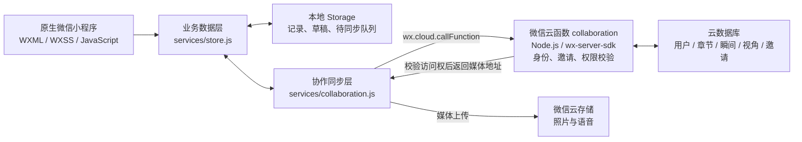

# ongoing_ / 未完｜个人项目课堂展示方案

> **更新提示（2026-09-19）：** 本文为上一版方案。当前 6 分钟汇报请以 [`个人展示内容包-6分钟终版.md`](./个人展示内容包-6分钟终版.md) 为准；终版已将 PPT 的“时间价值”与双视角 Demo 的“共同记录”拆开，避免功能重复。

> 内容定稿：2026-09-16。仅针对 `project-my summer holiday` 个人项目。  
> 汇报形式：7 页 PPT + 内嵌 100 秒 DEMO；正文按 **5 分 40 秒**安排，预留 20 秒缓冲。  
> 本文件确定展示内容、讲述顺序和演示脚本；此阶段不制作 PPT、不录制视频、不修改项目。

## 一、这次汇报让大家记住什么

**项目名称：ongoing_ / 未完——把此刻，留成一段生活。**

一句话介绍：一款原生微信生活记录小程序，用 Moment 留下照片、文字和声音，用 Chapter 组织一段生活，让朋友补充同一经历的不同视角，再通过日历、回望和时间来信重新看见这些记录。

全场围绕一个具体场景展开：**“这个夏天，我留下了什么，又和谁一起记得？”**

只强调三个特色，所有技术介绍都服务于它们：

| 特色 | 给用户的价值 | 汇报中的直接证据 |
| --- | --- | --- |
| **先记录，后整理** | 一句话也能留下；不用先建章节、填完整表单 | 从首页直接发布独立 Moment，再整理进 Chapter |
| **同一瞬间，不同视角** | 同一段经历可以保留每个人的文字、照片和声音 | Moment 详情同时展示原记录与独立署名的共同视角 |
| **记录会随时间产生回报** | 今天留下的内容，以后可以按日期、章节和时间关系重新阅读 | 日历 → 回望海报 → Memory Echo 时间来信 |

视觉上延续项目现有的浅色底、鼠尾草绿、杏色和淡紫。用真实界面、生活照片和生成的海报建立记忆点；每页只留一个主结论，界面文字要能在教室投屏时看清。

## 二、总时长与老师要求对应

以下安排依据[课程主页“个人项目总结汇报”](https://oucai.club/classes/MobileDev.html)：6 分钟内覆盖基本情况、实际架构、项目展示、问题解决和研发体会。这里采用总结汇报的 6 分钟要求。使用自己的电脑展示时，腾讯会议号为 **792-2557-5533**。

| 页码 | 页面标题 | 用时 | 累计时间 | 对应要求 |
| --- | --- | ---: | --- | --- |
| 1 | 这个夏天，你还记得哪一刻？ | 25 秒 | 00:00—00:25 | 基本情况：选题与动机 |
| 2 | 留下一刻，慢慢成为一段生活 | 40 秒 | 00:25—01:05 | 基本情况：对象、功能与特色 |
| 3 | 一条记录，如何从手机走到云端？ | 55 秒 | 01:05—02:00 | 实际架构、前后端和技术 |
| 4 | 用 100 秒，走过这个夏天 | 100 秒 | 02:00—03:40 | 项目 DEMO |
| 5 | 一个月后，今天会成为一封来信 | 45 秒 | 03:40—04:25 | 差异化功能与设计思考 |
| 6 | 共同记录，难在内容和身份都要对得上 | 45 秒 | 04:25—05:10 | 实际问题与解决方法 |
| 7 | 我学会了把一次操作，做成完整体验 | 30 秒 | 05:10—05:40 | 研发体会与收尾 |
| — | 切页、播放与语速缓冲 | 20 秒 | 05:40—06:00 | 不额外增加内容 |

## 三、逐页展示内容

### 第 1 页｜这个夏天，你还记得哪一刻？

**这一页的任务：用一个生活问题，让大家迅速理解项目为什么存在。**

屏幕内容：

- 主标题：**这个夏天，你还记得哪一刻？**
- 项目名：`ongoing_ / 未完`
- 副标题：把此刻，留成一段生活。
- 主要画面：项目中一张完整的 Chapter 回望海报；旁边只搭配一个 Moment 局部，保留照片、日期和一句话。
- 页脚：个人项目 · 微信小程序 · 汇报人姓名与学号。

讲述稿（25 秒）：

> 一个夏天拍了很多照片，过一阵再看，我们还记得当时发生了什么、和谁在一起吗？我的个人项目叫 ongoing_，中文名“未完”。我希望把照片、当时的一句话，以及朋友眼中的同一刻放在一起，让零散的记录，慢慢成为一段可以重新阅读的生活。

开场展示最终产物，第 4 页再让大家看见这张海报是怎样从记录中生成的。

### 第 2 页｜留下一刻，慢慢成为一段生活

**这一页的任务：把产品讲清楚，让后面的演示有一条容易跟上的主线。**

屏幕内容：

**目标用户：**希望记录日常、假期和共同经历的人。

用一条横向路径呈现产品结构：

```text
Moment 留下此刻 → Chapter 组织生活 → Review 回望这一章
       ↓                                  ↑
Perspective：朋友补充同一瞬间的不同视角 ──────┘
```

路径下方只放三个短句：

- 写一句、加照片、留声音；Chapter 归属可选。
- 每个人的视角独立保存、独立署名。
- 从时间线、日历和回望重新阅读记录。

底部放当前三个主入口的小图：**当下 / 生活 / 我的**。只说明分工，不逐个展开页面。

讲述稿（40 秒）：

> 这个产品面向想记录日常、假期和共同经历的人。最小单位是 Moment，一句话、一张照片或一段声音都可以，先留下，再决定要不要归类。Chapter 可以是一个夏天，也可以是一次旅行。朋友能为同一条记录留下自己的视角，各自的内容和署名都会保留。记录积累之后，可以按日期浏览，也能回望整段生活。三个主入口分别负责今天的记录、已有生活的浏览，以及个人档案。

### 第 3 页｜一条记录，如何从手机走到云端？

**这一页的任务：证明产品有实际的数据与后端设计，让非技术同学也能听懂。**

屏幕以一张架构图为主：



图下只留三条技术结论：

1. **前端：**原生小程序 + 复用组件；照片、录音和 Canvas 海报使用微信能力。
2. **数据：**先保存本地，再后台同步；页面通过统一数据层读取内容。
3. **后端：**微信云开发；云函数识别真实 OPENID，校验章节成员、记录作者和邀请范围。

边角放一条精简的数据关系：

`Chapter → 多条 Moment → 每条可有多个 Contribution（共同视角）；Moment 也可独立存在。`

讲述稿（55 秒）：

> 前端使用原生微信小程序，页面和通用组件负责交互，业务数据统一放在 store 层管理。用户保存一条记录时，先写入本地，照片和声音也做本地持久化，再由协作层上传媒体、处理待同步操作。后端采用微信云开发，collaboration 云函数负责邀请、读写和权限校验，数据库存五类业务数据，云存储保存媒体。共同视角对应独立的数据记录，因此朋友修改自己的内容，不需要覆盖原记录。海报则由前端 Canvas 生成。

**本页页脚的完成度说明：**“协作代码与本地隔离账号测试已完成；当前版本云端部署及真实双账号验收待确认。”本地实现与测试依据见项目交接记录，不将其表述为线上验收通过。

### 第 4 页｜用 100 秒，走过这个夏天

**这一页的任务：用一段连续故事展示产品闭环，把特色变成看得见的操作结果。**

屏幕只保留视频和一行进度词：

**留下 → 整理 → 一起记得 → 按日回看 → 留成海报**

演示场景统一为一个夏日 Chapter，展示名称可定为 **“我的这个夏天”**。下面的记录文案是演示脚本示例；如使用预置内容，画面注明“课程演示数据”。

| 视频时间 | 画面与操作 | 同步讲述要点 | 观众应看到的结果 |
| --- | --- | --- | --- |
| 00:00—00:20 | 首页点“记录此刻”，输入“今天的风很舒服，想把这一刻留下。”，添加一张照片，不选 Chapter，发布 | “先把此刻留下，归类可以晚一点。” | 进入详情，出现“这一刻留下了”和实际记录日数 |
| 00:20—00:32 | 在刚发布的详情点“整理到 Chapter”，选择“我的这个夏天” | “刚才独立的记录，现在收进了这一段生活。” | 记录出现章节归属，可以进入对应 Chapter |
| 00:32—01:00 | 打开同章内预先准备好的共同 Moment，展示原记录、朋友的视角和独立署名；停留在“留下我的视角 / 编辑我的内容”区域 | “同一刻，每个人记住的细节不同；各自的内容可以继续补充。” | 同一 Moment 中保留不同作者的内容，而非覆盖原文 |
| 01:00—01:13 | 返回 Chapter，进入“日历”，选择一个有记录的日期 | “这段生活也能按日期重新翻开。” | 日历标记与当天的真实记录对应 |
| 01:13—01:40 | 进入“回望”，略过统计和精选瞬间，选择照片、生成海报，最后停留在生成结果 | “这些零散的瞬间，最后成为一张属于这一章的海报。” | 显示实际生成的海报，与第 1 页呼应 |

录制素材只需提前具备：一个有多日记录的 Chapter、一条包含不同作者内容的共同 Moment、可用于海报的照片。演示中的新 Moment 先整理，再展示已有共同记录，避免临时完成复杂邀请操作占用时间。

**共同记录片段的口径：**当前默认展示已准备的共同视角内容，说明功能和数据结构；若使用本地样例，字幕写“共同视角示例”，不将其说成刚完成的跨设备同步。

如果录制前已完成真实双账号验收，可以用以下内容**替换** 00:32—01:00 的 28 秒片段：A 复制单条 Moment 邀请 → B 在“生活 → 加入共同记录”粘贴并确认 → B 留下视角 → A 刷新看到内容。画面标注 A、B 账号；采用剪辑压缩等待时间，保持总视频 100 秒。

视频播放时由汇报人讲述，不再叠加另一份完整配音。输入和等待可适当加速，发布结果、共同视角、生成海报各留出可读的停顿。

### 第 5 页｜一个月后，今天会成为一封来信

**这一页的任务：把“时间来信”作为第二个记忆点，解释长期使用的价值。**

屏幕内容：

- 大图：首页 **“时间来信 / Memory Echo”** 的真实界面。
- 放大两个信息：旧记录的日期、被带回今天的原因，例如“大约一个月前”。
- 配一张小图：“我的 → 生活档案”，展示记录日数、Moment 数和开始日期。
- 页面结论：**今天留下此刻，以后重新看见自己的生活。**

讲述稿（45 秒）：

> 我最想保留的一个细节，是首页的“时间来信”。它会根据记录的日期，把往年同日、大约一个月前的记录，或者某一章的第一刻重新带到今天，也会告诉你为什么出现。照片、文字和声音都可以成为这封来信。没有符合条件的旧记录时，这块内容就隐藏。生活档案里的数字也来自实际留下和参与的内容。我希望使用得越久，用户越能看到自己走过的日子。

准备这页时，使用真实日期的旧记录；如使用课程样例，标注样例身份。筛选是日期规则，口头不扩展成 AI 推荐或自动生成回忆。

### 第 6 页｜共同记录，难在内容和身份都要对得上

**这一页的任务：讲清两个实际处理过的问题，用“问题—解决—证据”体现研发深度。**

屏幕内容：

| 实际问题 | 项目中的解决方法 | 可以支撑的证据 |
| --- | --- | --- |
| **体验环境的微信分享卡片受限，邀请入口需要调整** | 改为“复制邀请文字 → 对方粘贴 → 云端预览 → 确认加入”；Chapter 邀请与单条 Moment 邀请分别限定范围 | 当前邀请弹层、生活页加入入口、云函数邀请逻辑 |
| **共同记录涉及多账号、弱网和修改归属，保存与同步必须衔接** | 云函数读取真实 OPENID；按账号隔离缓存与草稿；修改先进入持久化待同步队列；共同视角独立保存并校验作者 | 身份校验、账号隔离、断网补传及权限检查的本地测试记录 |

讲述稿（45 秒）：

> 开发时首先遇到的是体验环境中的分享限制，所以我把邀请改成复制文字、粘贴加入，并由云端确认邀请的是整章还是单条记录。另一个重点是共同记录的一致性：谁写的、谁能改，换账号或断网之后，内容应当属于谁。我用真实微信身份做校验，隔离不同账号的本地数据，再用持久化队列处理同步。项目已有相关本地测试记录，云端部署后的真实双账号验收还需要完成。

口头只讲这两个问题。素材压缩、按钮样式、安全区等细节留作追问材料，不塞入主讲时间。

### 第 7 页｜我学会了把一次操作，做成完整体验

**这一页的任务：给出具体的研发体会，用项目的核心价值收尾。**

屏幕内容：

1. **产品取舍：**内容优先，归类可选；让记录更容易开始。
2. **工程意识：**把保存、同步、身份、权限和再次读取串成完整流程。
3. **体验细节：**没有照片、没有旧记录、内容未写完时，也要给出合适的页面状态。

底部小字：下一步完成当前版本的云端部署、双账号真机与机型兼容验收。

最后一句大字：

**ongoing_｜此刻很轻，时间会记得。**

讲述稿（30 秒）：

> 这次开发让我学会了三件事：用产品取舍降低记录门槛；让保存、同步和权限形成完整流程；照顾空内容、草稿和失败状态这些细节。接下来重点补齐云端部署后的双账号和真机兼容验收。ongoing_ 想做到的，就是今天很容易留下一刻，以后能重新看见自己的生活。谢谢大家。

## 四、内容取舍与呈现口径

### 主讲内容已经确定

保留：**快速记录、可选归类、共同视角、日历、回望海报、时间来信，以及支撑这些功能的本地与云端架构。**

搜索、收藏、成员管理、目标、完整设置和所有增删改按钮不逐项演示。当前 Chapter 页面代码仍保留“目标”和“成员”标签；本次主动聚焦“瞬间 / 日历 / 回望”，不宣称它们是页面仅有的三个标签。

汇报以个人项目口吻使用“我”。让同学通过演示看到特色与完成度，不在 PPT 上自评“5 分”或堆砌功能数量。

### 区分实现、测试和真实运行结果

- 架构依据当前源代码；课程要求依据课程主页。
- 云端协作已有客户端、云函数和测试实现。项目交接记录注明相关本地检查通过，但本轮最新云函数部署、最新体验版及真实双账号验收尚未确认。只按已有证据介绍完成度。
- 文中的记录、海报、统计和 Memory Echo 画面，应在后续制作展示材料时从实际运行中取得；样例内容明确标注，不把预置数据当作个人长期使用成果。
- 前台刷新、定时同步和下拉刷新是当前同步方式，不描述为实时推送；没有计时数据，不承诺“秒开”或“零延迟”。

### 六分钟执行规则

- **02:00 开始 DEMO，03:40 结束视频，05:40 完成收尾。**视频计入总时长。
- 腾讯会议共享包含视频的窗口，播放前定位好进度；主讲只用一条已经录好的完整演示路径。
- 演示采用录屏。如播放异常，直接切到同一流程的关键截图，继续按原时间讲述。
- 发现进度偏慢，先删第 5 页的“生活档案”补充和第 6 页的技术展开，保留特色结论、两个问题和研发体会。

## 五、本方案的项目依据

以下用于后续核对和应对提问，不作为额外 PPT 页面。

| 内容 | 当前项目依据 |
| --- | --- |
| 原生小程序、启动与后台刷新 | [app.json](./app.json)、[app.js](./app.js) |
| 当下 / 生活 / 我的三个主入口 | [底部导航组件](./components/app-tabbar/app-tabbar.wxml) |
| 内容优先、归类可选、发布入口 | [Moment 编辑页](./pages/moment/editor/index.wxml) |
| 共同视角、独立署名、稍后整理 | [Moment 详情页](./pages/moment/detail/index.wxml) |
| 当前 Chapter 标签与日历行为 | [Chapter 页面逻辑](./pages/chapter/detail/index.js) |
| 业务数据、账号缓存、待同步队列、Echo 与生活统计 | [services/store.js](./services/store.js) |
| 云调用、媒体上传、邀请与同步 | [services/collaboration.js](./services/collaboration.js) |
| 后端身份、权限与五类数据库集合 | [collaboration 云函数](./cloudfunctions/collaboration/index.js) |
| 回望页面、照片选择与 Canvas 海报 | [回望页面](./pages/review/index.wxml)、[海报生成服务](./services/review-poster.js) |
| 当前完成度与真实双账号验证边界 | [HANDOFF.md](./HANDOFF.md)、[CLOUD_SETUP.md](./CLOUD_SETUP.md) |

本方案只做了文档与源码核对，没有新增运行测试、操作云环境或更改应用功能。
